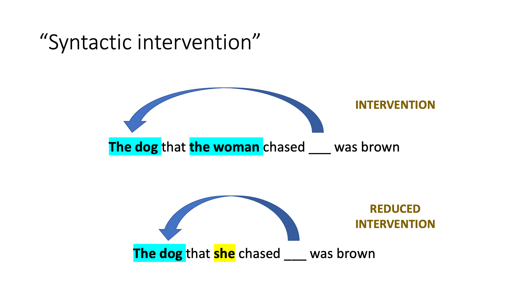
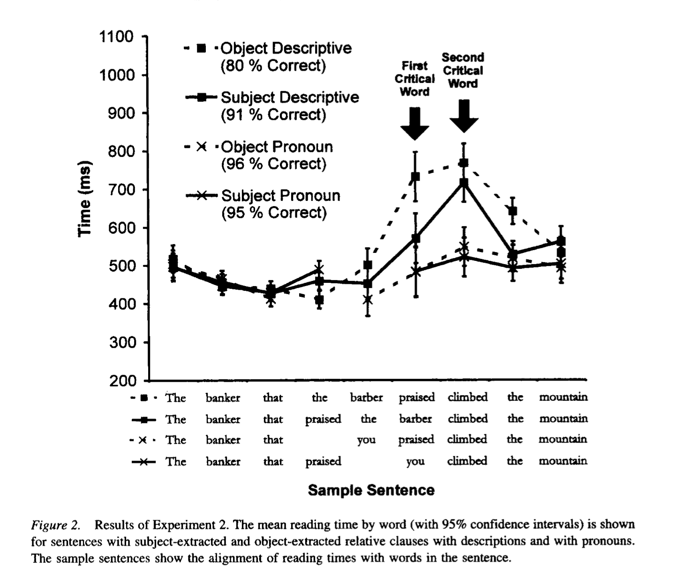
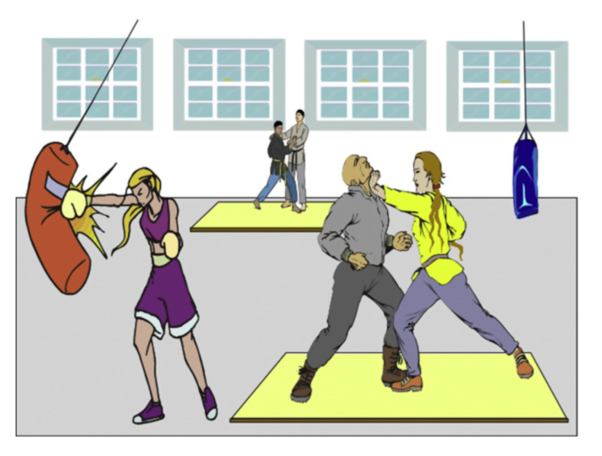
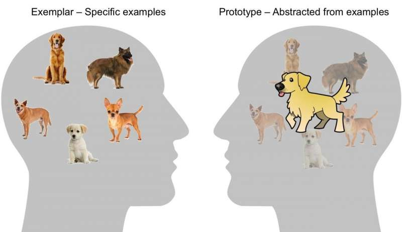
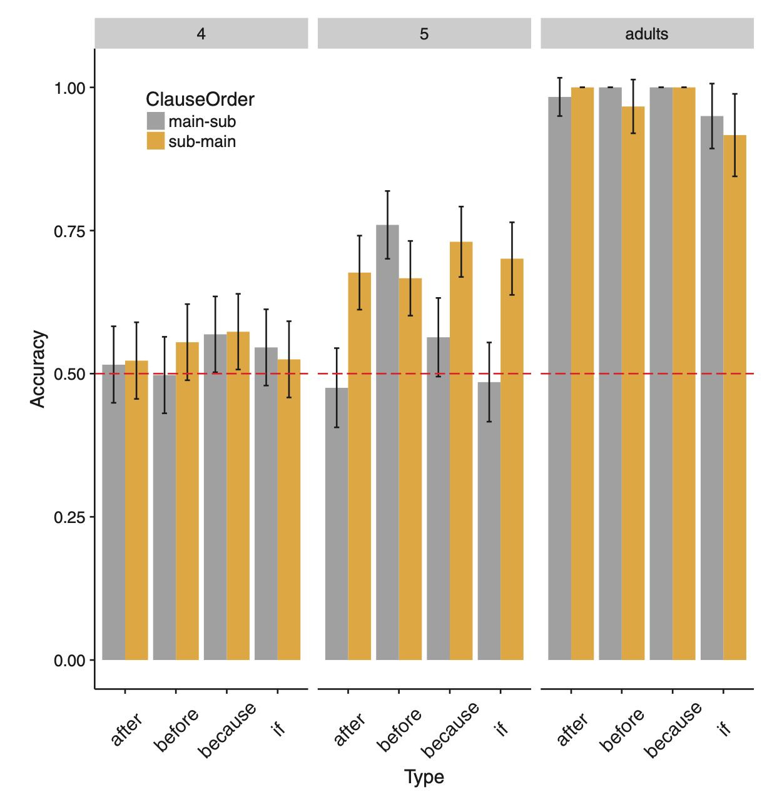
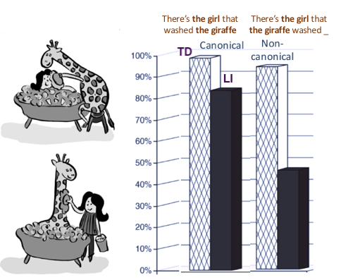
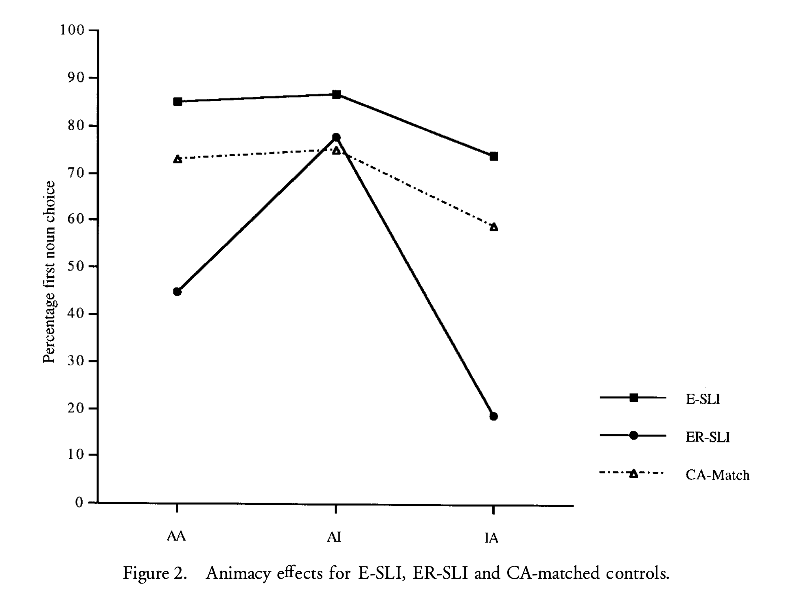
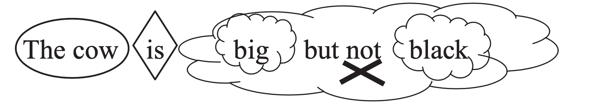
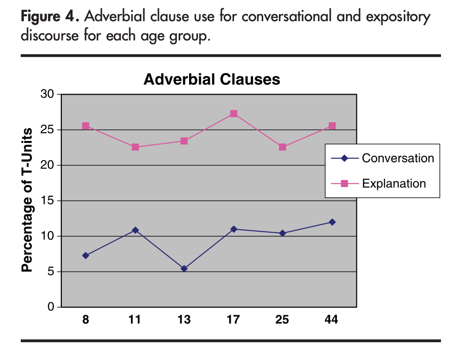

```{r setup, include=FALSE, echo = FALSE}

slides = 0

styling_for_level1_slides = "{data-background=\"https://media.giphy.com/media/26FKXX8GHBznnBe0w/giphy.gif\" style=\"color:white\"}"

{###### FOLD HERE
  
pacman::p_load(tidyverse) # pacman library needs to be installed
# If pacman library is not installed you can install and load the tidyverse.

knitr::opts_chunk$set(echo = FALSE)

from_begin_to_slide_begin <- "(===begin===.*?s[=]+)"
from_slide_end_to_slide_begin <- "(s[-]+.*?s[=]+)"
from_slide_end_to_end <- "(s[-]+)(?!.*s[-]+).+"

from_slide_begin_to_slide_end <- "(s[=]+.*?s[-]+)"

# title_no_style <- "(^\x23\x20[^}\n]+\n)"

level1_header_minus_style <- "(?<!#)# ([^#\n\x7d]+)\n"


add_style_to_level1_header <- function(x){
  if(length(unlist(str_extract_all(x, "#")) == 1) & str_detect(x, "\\{[^\\{]*\\}") == FALSE) x <- paste(x, styling_for_level1_slides)
  return(x)
}

extract_headers <- function(x){
  headers <- unlist(str_extract_all(x, "[#]+[\x20]+[^\n]+"))
  # headers <- add_style_to_level1_header(headers)
  headers <- paste0(headers, collapse = "\n")
  return(headers)
}

add_style <- function(x){
  return(paste(x, styling_for_level1_slides, "\n"))
}

text_effects <- function(x){
  
  # "fade-in" fi
  x <- str_replace_all(x, regex("(\\[)([0-9]+)fi([\x20]?)([^\\[]+)(\\])", multiline = TRUE), "<span class=\"fragment\" data-fragment-index=\"\\2\">\\4</span>")
  
  # "fade-out" fo
  x <- str_replace_all(x, regex("(\\[)([0-9]+)fo([\x20]?)([^\\[]+)(\\])", multiline = TRUE), "<span class=\"fragment fade-out\" data-fragment-index=\"\\2\">\\4</span>")
  
  # "fade-in-then-out" fio
  x <- str_replace_all(x, regex("(\\[)([0-9]+)fio([\x20]?)([^\\[]+)(\\])", multiline = TRUE), "<span class=\"fragment fade-in-then-out\" data-fragment-index=\"\\2\">\\4</span>")
  
  # "fade-in-then-semi-out" fiso
  x <- str_replace_all(x, regex("(\\[)([0-9]+)fiso([\x20]?)([^\\[]+)(\\])", multiline = TRUE), "<span class=\"fragment fade-in-then-semi-out\" data-fragment-index=\"\\2\">\\4</span>")
  
  # "highlight-red" hr
  x <- str_replace_all(x, regex("(\\[)([0-9]+)hr([\x20]?)([^\\[]+)(\\])", multiline = TRUE), "<span class=\"fragment highlight-red\" data-fragment-index=\"\\2\">\\4</span>")
  
  # "highlight-red" (using genuine block highlight effect) HR
  x <- str_replace_all(x, regex("(\\[)HR([\x20]?)([^\\[]+)(\\])", multiline = TRUE), "<span class=\"mark\" style=\"background-color: pink;\">\\3</span>")
  
  # "highlight-green" (using genuine highlight effect) HG
  x <- str_replace_all(x, regex("(\\[)HG([\x20]?)([^\\[]+)(\\])", multiline = TRUE), "<span class=\"mark\" style=\"background-color: PaleGreen;\">\\3</span>")
  
  # "highlight-green" (using genuine highlight effect) HB
  x <- str_replace_all(x, regex("(\\[)HB([\x20]?)([^\\[]+)(\\])", multiline = TRUE), "<span class=\"mark\" style=\"background-color: PowderBlue;\">\\3</span>")
  
  # "highlight-yellow" (using genuine highlight effect) HY
  x <- str_replace_all(x, regex("(\\[)HY([\x20]?)([^\\[]+)(\\])", multiline = TRUE), "<span class=\"mark\" style=\"background-color: Yellow;\">\\3</span>")
  
  # "highlight-orange" (using genuine highlight effect) HO
  x <- str_replace_all(x, regex("(\\[)HO([\x20]?)([^\\[]+)(\\])", multiline = TRUE), "<span class=\"mark\" style=\"background-color: Orange;\">\\3</span>")
  
  # "highlight-purple" (using genuine highlight effect) HP
  x <- str_replace_all(x, regex("(\\[)HP([\x20]?)([^\\[]+)(\\])", multiline = TRUE), "<span class=\"mark\" style=\"background-color: Orchid;\">\\3</span>")
  
  # "highlight-green" hg
  x <- str_replace_all(x, regex("(\\[)([0-9]+)hg([\x20]?)([^\\[]+)(\\])", multiline = TRUE), "<span class=\"fragment highlight-green\" data-fragment-index=\"\\2\">\\4</span>")
  
  # "highlight-blue" hb
  x <- str_replace_all(x, regex("(\\[)([0-9]+)hb([\x20]?)([^\\[]+)(\\])", multiline = TRUE), "<span class=\"fragment highlight-blue\" data-fragment-index=\"\\2\">\\4</span>")
  
  # "highlight-current-red" hcr
  x <- str_replace_all(x, regex("(\\[)([0-9]+)hcr([\x20]?)([^\\[]+)(\\])", multiline = TRUE), "<span class=\"fragment highlight-current-red\" data-fragment-index=\"\\2\">\\4</span>")
  
  # "highlight-current-green" hcg
  x <- str_replace_all(x, regex("(\\[)([0-9]+)hcg([\x20]?)([^\\[]+)(\\])", multiline = TRUE), "<span class=\"fragment highlight-current-green\" data-fragment-index=\"\\2\">\\4</span>")
  
  # "highlight-current-blue" hcb
  x <- str_replace_all(x, regex("(\\[)([0-9]+)hcb([\x20]?)([^\\[]+)(\\])", multiline = TRUE), "<span class=\"fragment highlight-current-blue\" data-fragment-index=\"\\2\">\\4</span>")
  
  # "strike" strike
  x <- str_replace_all(x, regex("(\\[)([0-9]+)strike([\x20]?)([^\\[]+)(\\])", multiline = TRUE), "<span class=\"fragment strike\" data-fragment-index=\"\\2\">\\4</span>")
  
  return(x)
}

resize_image <- function(x){
  return(str_replace_all(x, regex("h([0-9]+)\n!\\[\\]\\(([^\\(]+)\\)", multiline = TRUE), ""))
}   

if(slides == 1){
  
  hook_old <- knitr::knit_hooks$get("document")  # save the old hook
  
  knitr::knit_hooks$set(document = function(x) {
    
    # The following code uses regexes to edit document prior to being knit
    
    x <- str_replace_all(x, regex(from_begin_to_slide_begin, multiline = TRUE, dotall = TRUE), function(m) extract_headers(m))
  
    x <- str_replace_all(x, regex(from_slide_end_to_slide_begin, multiline = TRUE, dotall = TRUE), function(m) extract_headers(m))
        
    x <- str_replace_all(x, regex(from_slide_end_to_end, multiline = TRUE, dotall = TRUE), "")
    
    x <- str_replace_all(x, level1_header_minus_style, paste0("# \\1", styling_for_level1_slides, "\n"))
    
    x <- text_effects(x)
    
    x <- resize_image(x)
    
    hook_old(x)
  })
}


if(slides == 0){
  
  # NB slides only chunk begins "+++" and ends in "+++"
  hook_old <- knitr::knit_hooks$get("document")  # save the old hook
  
  knitr::knit_hooks$set(document = function(x) {
    
  x <- str_replace_all(x, regex(from_slide_begin_to_slide_end, multiline = TRUE, dotall = TRUE), "")
        
    x <- str_replace_all(x, "===begin===", "")
    
    hook_old(x)
  })
}


} ### END FOLD HERE

```

# Linguistic complexity and language impairment

# Aims of these sessions

## Aims

1. Revise key concepts in study of "complex "syntax
2. Motivate study of complex syntax with regarding to language-impaired individuals
3. Discuss ways to address difficulties with complex syntax

# Motivating the study of complex syntax

## Working definition

A complex sentence contains a "non-standard" word order and/or multiple clauses.

## Diagnosis

Language-impaired individuals are especially poor at producing / comprehending sentences with complex syntax

## Treatment

Complex sentences are important in certain contexts, e.g. educational texts.

The more complex an idea, the more complex our language gets (e.g. in terms of sentence structure).

Inability to produce / understand this kind of complex language poses considerable barriers to educational attainment / workplace success.

# What is complex syntax?

## Definition 1 - departure from "standard word order"

A complex sentences is one whose properties depart from the standard word order


Relative clauses may depart from standard **syntactic** word order, e.g.

- The dog $_{OBJECT}$ that the man $_{SUBJECT}$ chased $_{VERB}$ was brown

Passive sentences depart from standard **semantic** word order, e.g.

- The dog $_{PATIENT}$ was chased by the man $_{AGENT}$

In some sentences, there is a contrast between **order of mention** and **order of occurrence**

- Before she sat the exam, she took a few headache tablets.

Discourse cues impact on production / comprehension difficulty (see below)

## Definition 2 - displacement and movement of phrases

Complex sentences are traditionally interpreted as involving "movement" process.

E.g. *the dog* moves from the site where it "originates" (sometimes referred to as the "GAP" or "trace"

- The dog $_{OBJECT}$ that the man $_{SUBJECT}$ chased $_{VERB}$ ____ was brown

- The dog $_{PATIENT}$ was chased ____ by the man $_{AGENT}$

In terms of processing, this means that it is not till the "GAP" that we know what role a Noun Phrase plays in the sentence (see below).

## Definition 3 - Embedding

Complex sentences typically involve dependent (embedded clauses). Sometimes these can "interrupt" a clause, posng great difficulties for the listener


## Definition 4 - Postponement of "thematic integration"

When Noun Phrases are introduced it helps to know what role they play in a sentence

We need to wait for the verb in order to do this

It is difficult to maintain role-less NPs in memory

Verb-final structures, in particular, cause us to maintain role-less NPs.

- The dog $_{OBJECT}$ that the man $_{SUBJECT}$ chased $_{VERB}$  was brown

Compare this with

- The dog $_{SUBJECT}$ chased $_{VERB}$ the man $_{OBJECT}$

## Definition 5 - Interference between like Noun Phrases

When we maintain Noun Phrases in memory, there will be "interference" between Noun Phrases with similar properties, e.g. whether Noun Phrase is a full noun phrase (D + N) or a Pronoun.

@gordonEffectsNounPhrase2004

@gordonMemoryInterferenceLanguage2001

@gordonMemoryloadInterferenceSyntactic2002

Some theories describe this interference as "intervention" between a moved and a stationary NP





# What do complex sentences "do"?

## Discourse properties

Though complex sentences are often defined in terms of their structure, they also have key discourse properties

1. Relative clauses "ground" the head Noun Phrase in the discourse, e.g. *That neighbour [who I was telling you about] had an affair with his son's teacher*

2. Passives turn a non-subject into a topic (the thing we are talking about), e.g. *Have you seen **the Shawshank redemption? It** was directed by Frank Darabont*

## Complex sentences in expository discourse

"Expository discourse" = a type of discourse where we need to explain something complex, e.g. the rules of a game, an ecosystem etc.

Complex information requires complex language!

# PRACTICE

## Practice 1 - Identifying complex sentences

(1) The mode is not the best measure because there are two modes that are very far apart

(2) A router is any piece of hardware or software that forwards packets based on their destination IP address. Routers work, therefore, at Layer 3, the Network layer. Classically, routers are dedicated boxes that contain at least two connections, although many routers contain many more connections. 

(3) Like rainforests, coral reefs contain many animals and plants that produce potentially valuable chemicals. For this reason, it is important to protect the reefs from damage from many sources. Unfortunately, reefs are in danger from natural disasters and from humans. Natural forces, such as water that is too warm,can kill corals and produce a phenomenon called coral bleaching. Organisms that eat living corals, such as the crown-of-thorns sea star, can greatly damage reefs.

(All examples taken from Marilyn Nippold, RCSLT Keynote presentation, 2021)

## Practice 2 - placing sentences in order of difficulty

Which of these sentences are difficult, and why?

- She had a bad tummy because she ate too many pies

- Because she ate too many pies she had a bad tummy

- The sausage that I dropped fell on a clean surface, so I took the risk and popped it my mouth

- The lawyer that the disgruntled employee visited laid out the facts of the case as best she could.
- Mary was not trusted by her colleagues
- Janice got chosen for the school play
- Which man was the woman chasing?
- Who did she chase?

## Practice 3 - comprehension / elicitation

How would you test comprehension of / elicitation of complex sentences?

## Eliciting complex sentences

(1) Priming


(2) Sentence completion


(3) Elicitation with visual prompt


- Who is bald?
- 
- Definitions game, e.g. with cards. A defines an object, e.g. "This is something which you use to put up a picture", and B selects a picture, e.g. A HAMMER

## Testing comprehension of complex sentences

(1) Forced choice picture-selection task


For this kind of task to work, sentences must be "reversible", i.e. interpretation based on misunderstanding the sentence needs to be as plausible as correct interpretation.

IMPORTANT POINT: Picture selection tasks test comprehension of sentences which are particularly complex due to presence of FULL NPs.

(2) Agent-identification task

"The horse is getting kicked by the cow. Who's naughty?"

The child puts the naughty animal in the naughty box

(3) Act out task

"The horse is getting kicked by the cow". Then the participant has to act out the event with toys.

# Theories of difficulty with complex sentences

## Exemplar / prototype theories

Our brain contains "ideal" models for things (words, categories, structures etc.)

What is the "ideal" James Bond film?

What is the "ideal" vegetable?

What is the "ideal" tool?

What is the "ideal" bird?

Prototype theory = we have an actual representation of ideal models

Exemplar theory = we create ideal representations spontaneously on the basis of past experience.



Some researchers have suggested that our linguistic representations are exemplar-based @bybeeUsagebasedTheoryExemplar2013, @ambridgeStoredAbstractionsRadical2019.

If this is the case, then our exemplars contain relatively fine-grained, detailed, non-abstract information, e.g. object relatives tend to contain animate heads, and a pronoun in the second argument slot

* The sausage that I dropped fell on a clean surface

Or passives tend to contain affected subjects

- Janice got chosen for the school play

## Working memory-based theories

Individuals with limited working memories appear to have difficulties understanding sentences where interference between like NPs is presumed

@montgomeryVerbalWorkingMemory2000

@montgomeryComplexSentenceComprehension2009

## Language production accounts

We have a strong tendency to avoid structures with full Noun Phrases which are (a) close to each other (b) thematically unintegrated.

"Avoidance phenomena"

Who is bald?


In order to avoid producing two full NPs close to each other we need to use the passive, e.g.

- The man who is being hit by the woman

Avoidance rates increase during development, possibly because adults are better at adopting avoidance strategies.

@contemoriRelativesPassiveObject2013

| Age        | Percentage of avoidance structure |
| ---------- | --------------------------------- |
| 4;0 - 4;11 | 5%                                |
| 5;0 - 5;11 | 12%                               |
| 6;0 - 6;11 | 15%                               |
| 7;0 - 7;11 | 5%                                |
| 8;0 - 8;10 | 40%                               |
| Adult      | 97%                               |
|            |                                   |


## "Structural" theories

Relativised Minimality: structural theory which proposes that sentences are more difficult to understand when "like" crosses "like" @rizziRelativizedMinimality1990


# What happens in development

## Relative clauses

Early types of relative clauses are "presentational", i.e. don't involve coordinating relative clause with the main clause, e.g. @brandtAcquisitionGermanRelative2008

- There's the cake she made

Young children's production of relative clauses is greatly helped when discourse / animacy properties of relative clauses match those of the input  @kiddObjectRelativesMade2007

## Passives

Early forms of the passive involve STATE verbs

- It's broken

Later forms involve EVENT verbs

- The butterfly was killed by the verb

It is not until about 5;0 or 6;0 that children are able to understand passives with non-action verbs, e.g. perception verbs @maratsosSemanticRestrictionsChildren1985 

- Thd dog was seen by the cat

Adults also seem to find passives more acceptable if they contain event verbs and highly affected subjects. @ambridgePassiveSyntaxSemantically2016

## Temporal conjunctions

@deruiterIconicityAffectsChildren2018

When presentation of main clause and dependent clause is "iconic" (i.e. order of mention matches order of occurrence), children show much better comprehension:



Production data from corpora demonstrates similar patterns:

@ruiterStructuralInteractionalAspectsundefined/ed


# Difficulties of language impaired individuals

## "Steeper profiles" in language-impaired individuals



## Dependency on standard word order (children)


@evansSentenceProcessingStrategies1999


## Dependency on other cues (children)

Evans & MacWhinney



## Association between working memory difficulties and processing of complex sentences (children)

There is generally a strong association between working memory abilities in children and the ability to understand complex sentences

## Complexity approaches to intervention (adults)

Training on more complex sentences generalises to simpler sentences!


# Intervention approaches

## Working memory training

@zakariasTransferEffectsSpoken2018

3 individuals with aphasia. Working Memory training ("nback" task) led to improvements in understanding of complex sentences.

@stanfordEffectWorkingMemory2019

Effect of working memory training on use of third person accusative clitics in French, e.g. *Jean le voit* (Jean sees him). This seems to involve movement of the NP *him* to a higher position.

## Increased exposure via story-telling / environmental manipulation

Narratives which focus on indirect speech lead to improvements in use of indirect speech. @serratriceUseReportedSpeech2015

Narraties which focus on passives lead to improvements in use of passives @garraffaPositiveEffectsPassive2021

Curran et al. taught complex sentences involve adverbs of causation (if, because) in the context of science classes. This is because science classes involve a discussion of causality. The intervention (based on metalinguistic approaches) was effective, but there was limited evidence of generalisation to academic learning. @curranUseRecastIntervention2019

## Metalinguistic approaches

@ebbelsImprovingComprehensionAdolescents2013



## Working with cues

Making "cues" (animacy cues, discourse cues) consistent with the input can facilitate learning, e.g. @kiddObjectRelativesMade2007.

Which of the following have supportive cues?

- The car that she bought was yellow / The cat that the dog chased was brown.

- Because she ate the pie she was ill / She at the pie because she was ill
- Which dog was the cat chasing? / What did it chase?
- The parrot was seen by the koala / The parrot got chased by the cat

## A complexity hierarchy for relative clauses

| Level | Argument<br />Semantics (equal/<br />un-equal animacy) | Discourse<br />(NP or<br />Pron Subj.) | Syntax<br />(presentation<br />-al structure) | Example                          |
| ----- | ------------------------------------------------------ | -------------------------------------- | --------------------------------------------- | -------------------------------- |
| 1     | EASY                                                   | EASY                                   | EASY                                          | There's the vase he broke        |
| 2a    | DIFFICULT                                              | EASY                                   | EASY                                          | There's the cat he chased        |
| 2b    | EASY                                                   | DIFFICULT                              | EASY                                          | There's the vase the boy broke   |
| 2c    | EASY                                                   | EASY                                   | DIFFICULT                                     | The vase he broke was red        |
| 3a    | DIFFICULT                                              | DIFFICULT                              | EASY                                          | There's the cat the boy chased   |
| 3b    | EASY                                                   | DIFFICULT                              | DIFFICULT                                     | The vase the boy smashed was red |
| 3c    | DIFFICULT                                              | EASY                                   | DIFFICULT                                     | The cat he chased was brown      |
| 4     | DIFFICULT                                              | DIFFICULT                              | DIFFICULT                                     | The cat the boy chased was brown |

## A complexity hierarchy for passives

| Level | Affect-<br />edness of Subj. | State or event | Discourse<br />(is Subj. pronoun?) | Syntax<br />(by-phrase?) | Example                         |
| ----- | ---------------------------- | -------------- | ---------------------------------- | ------------------------ | ------------------------------- |
| 1     | EASY                         | EASY           | EASY                               | EASY                     | The vase was broken (STATE)     |
| 2a    | DIFF                         | EASY           | EASY                               | EASY                     | It was broken (STATE)           |
| 2b    | EASY                         | DIFF           | EASY                               | EASY                     | It's being broken (EVENT)       |
| 2c    | EASY                         | EASY           | DIFF                               | EASY                     | The vase was broken (STATE)     |
| 3a    | EASY                         | DIFF           | EASY                               | DIFF                     | It was broken by the dog* (EV.) |
| 3b    | DIFF                         | EASY           | DIFF                               | EASY                     | The boy was well-liked (ST.)    |
| 4     | EASY                         | DIFF           | DIFF                               | DIFF                     | The vase was broken by the dog  |
| 5     | DIFF                         | DIFF           | DIFF                               | DIFF                     | The dog was seen by the cat     |

## Complexity gradients for object questions

| Level | Argument Semantics (equal/unequal animacy) | Discourse (NP or Pron Subject) | Example                         |
| ----- | ------------------------------------------ | ------------------------------ | ------------------------------- |
| 1     | EASY                                       | EASY                           | Which tree was he cutting?      |
| 2a    | DIFF                                       | EASY                           | Which boy was he chasing?       |
| 2b    | EASY                                       | DIFF                           | Which tree was the boy cutting? |
| 3a    | DIFF                                       | DIFF                           | Which boy was the girl chasing? |

## But what to do with these complexity gradients?

@vanhorneHardThingsFirst2017

We need to "disrupt" exemplar-based systems by exposing children to more complex stimuli.

NB paper investigated past tense production, not complex sentences.

# Expository discourse

## What is expository discourse?

"Expository discourse" = a discourse which involves explaining something complicated, e.g. the rules of a game of sport, or a topic in science (e.g. an ecosystem)

Can be contrasted with "narrative" discourse, or "conversational" discourse.

## Expository discourse and language development

There is a strong relationship between complexity of discourse and linguistic complexity. @nippoldExpositoryDiscourseChildren2010

Strong developmental trajectory for relative clauses with moderate effect of expository discourse

	

Moderate growth in adverbial clauses, but dramatic effect of expository discourse.



## Expository discourse and language impairment

Older children / adolescents with language impairments overcome more obvious difficulties, e.g. morphological errors, but main difficulty is using complex syntax in the service of "expository discourse".

But introduction of expository discourse leads to a significant boost in complexity! (see below)


Could we generate expository discourse contexts in order to teach complex syntac to language-impaired children?


